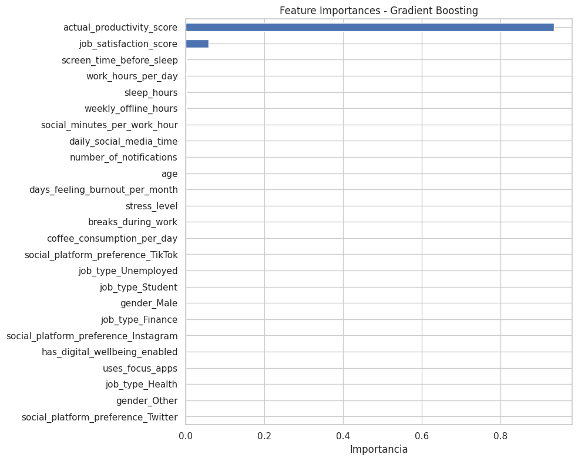
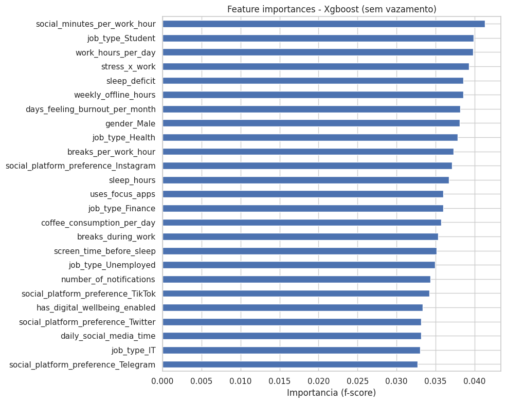

# Integrantes
Gustavo Henrique Campos, Nataly Braga Souza

# Impacto do Uso de Redes Sociais na Produtividade: Uma Análise Preditiva

Este repositório contém o trabalho prático de Aprendizado de Máquina focado em investigar a relação entre o uso de redes sociais e a produtividade individual.

O objetivo principal era (1) construir um modelo preditivo para estimar a produtividade e (2) identificar quais fatores comportamentais (como sono, estresse e tempo de tela) mais impactam o resultado.

A principal contribuição deste trabalho não foi a criação de um modelo preditivo funcional, mas sim a **descoberta, comprovação e correção de um severo *data leakage*** (vazamento de dados) presente no dataset.

## A Jornada Analítica

O repositório foi estruturado em dois *commits* para simular a jornada de descoberta.

### 1. Descoberta do Vazamento (Commit 1)

A análise inicial (script `analise_inicial.py`) utilizou todos os dados "como estavam". Isso gerou resultados enganosamente promissores:

* **R² Alto:** Um modelo de Regressão Linear atingiu um Coeficiente de Determinação (R²) de **0.82**.
* **A Prova do Vazamento:** Contudo, ao rodar um Gradient Boosting e analisar a importância das *features* (Figura 1), a causa do R² alto ficou clara. O modelo estava ignorando as *features* comportamentais e usando "gabaritos" (como `actual_productivity_score` e `job_satisfaction_score`) para prever o alvo.

Ao rodar o script `analise_inicial.py`, o gráfico **`saida/feature_importances_inicial.png`** é gerado. Ele comprova o vazamento ao mostrar o modelo atribuindo quase toda a importância a uma única coluna de "gabarito".



---

### 2. A Análise Corrigida (Commit 2)

Após a descoberta, o script `analise_corrigida.py` foi criado para executar uma análise "honesta":

1.  **Correção:** As colunas de vazamento (`actual_productivity_score`, `perceived_productivity_score`, `job_satisfaction_score`) foram cirurgicamente removidas das *features*.
2.  **Engenharia de Features:** Novas *features* (como `stress_x_work` e `sleep_deficit`) foram criadas para tentar encontrar um sinal preditivo.
3.  **Resultado Real:** Quatro algoritmos (incluindo XGBoost) foram testados. Os resultados foram inequívocos: **todos os modelos falharam em encontrar um padrão preditivo**, resultando em métricas de R² nulas ou negativas.

Ao rodar o script `analise_corrigida.py`, o gráfico **`saida/feature_importance_XGB_SEM_VAZAMENTO.png`** é gerado. Ele mostra uma distribuição "plana", provando que, sem o vazamento, as *features* comportamentais não possuem poder preditivo.



## Estrutura do Repositório

```
/
├── .gitignore           # Ignora o venv e /data
├── README.md            # Este arquivo
├── requirements.txt     # Dependências do projeto
├── analise_inicial.py   # Script do Commit 1 (descobre o vazamento)
├── analise_corrigida.py # Script do Commit 2 (análise final honesta)
├── data/
│   └── (coloque seu .csv aqui)
└── saida/
    └── (resultados gerados pelos scripts)
```
*(A pasta `/data/` é ignorada pelo `.gitignore`, mas a pasta `/saida/` está visível neste repositório para documentação)*

## Como Executar

1.  Clone este repositório.
2.  Crie e ative um ambiente virtual:
    ```bash
    python3 -m venv venv
    source venv/bin/activate
    ```
3.  Instale as dependências:
    ```bash
    pip install -r requirements.txt
    ```
4.  **Importante:** Coloque o arquivo `.csv` do dataset dentro da pasta `/data/`. (O `.gitignore` está configurado para não enviar esta pasta).

5.  **Para replicar a descoberta do vazamento (Commit 1):**
    ```bash
    python analise_inicial.py data/social_media_vs_productivity.csv
    ```

6.  **Para replicar a análise final corrigida (Commit 2):**
    ```bash
    python analise_corrigida.py data/social_media_vs_productivity.csv
    ```

7.  Os resultados (gráficos e tabelas `.csv`) serão atualizados na pasta `/saida/`.